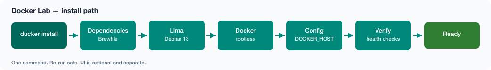
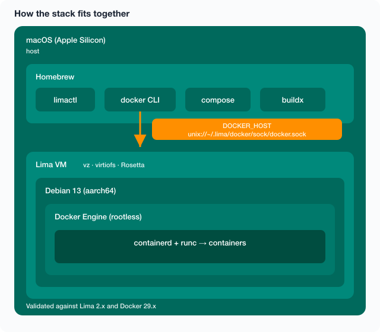
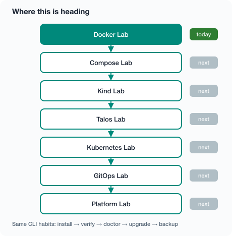

# Docker Lab

[](https://github.com/nasraldin/docker-lab/actions/workflows/ci.yml)
[](https://github.com/nasraldin/docker-lab/actions/workflows/docs.yml)
[](LICENSE)
[](https://github.com/nasraldin/docker-lab/releases/latest)
[](https://github.com/nasraldin/docker-lab/releases)
[](https://nasraldin.github.io/docker-lab/)

Run real Linux Docker on Apple Silicon — using Apple’s native Virtualization framework (`vz`), so it stays light on CPU and RAM instead of a heavyweight hypervisor stack. Debian 13 in Lima, rootless Engine, one CLI: **`ducker`**.



You need **macOS on Apple Silicon** and [Homebrew](https://brew.sh).

---

## Why bother?

|                                            | Docker Desktop | OrbStack | Docker Lab |
| ------------------------------------------ | -------------- | -------- | ---------- |
| Open source                                | No             | No       | Yes        |
| Debian guest                               | No             | No       | Yes        |
| Rootless                                   | Yes            | Yes      | Yes        |
| Full control of `daemon.json`              | Limited        | Partial  | Yes        |
| Everything in git (Brewfile, Lima, daemon) | No             | No       | Yes        |

Stack under the hood: Lima + Debian 13 + rootless Docker on Apple’s native `vz` (plus virtiofs and Rosetta).

---

## Install

### One-liner

```bash
curl -fsSL https://raw.githubusercontent.com/nasraldin/docker-lab/main/install.sh | bash
```

### Homebrew

```bash
brew tap nasraldin/tools
brew install ducker-lab
```

(The formula is `ducker-lab` because Homebrew already has an unrelated package named `ducker`. The CLI is still `ducker`.)

More on the tap: [Homebrew docs](https://nasraldin.github.io/docker-lab/homebrew/).

### From git

```bash
git clone https://github.com/nasraldin/docker-lab.git ~/homelab/docker-lab
cd ~/homelab/docker-lab
./ducker cli-install
ducker install
```

Then check it:

```bash
ducker status
ducker verify
ducker doctor
```

Optional UI (not part of install):

```bash
ducker ui install          # Dockhand
ducker ui install arcane
ducker ui open
```

---

## Handy commands

| Command                                 | Meaning                                          |
| --------------------------------------- | ------------------------------------------------ |
| `ducker install`                        | Set up the whole lab (safe to re-run)            |
| `ducker verify` / `doctor` / `diagnose` | Health checks                                    |
| `ducker doctor --fix`                   | Try the usual fixes                              |
| `ducker status` / `stats`               | What’s running                                   |
| `ducker benchmark`                      | Rough speed check                                |
| `ducker upgrade`                        | Update brew tools and re-apply config            |
| `ducker backup` / `restore`             | Save / restore config (optional VM dump)         |
| `ducker profile <name>`                 | `small`, `balanced`, or `power`                  |
| `ducker ui …`                           | Optional web UIs                                 |
| `ducker nuke`                           | Wipe everything (`CONFIRM=yes` skips the prompt) |

```bash
ducker about
ducker help
LIVE=1 ducker test         # needs a running VM
```

Install details: [Installation](https://nasraldin.github.io/docker-lab/installation/).  
Every command with sample output: [CLI reference](https://nasraldin.github.io/docker-lab/cli-reference/).

---

## How it fits together



More detail: [Architecture](https://nasraldin.github.io/docker-lab/architecture/).

---

## Docs

Site: [https://nasraldin.github.io/docker-lab/](https://nasraldin.github.io/docker-lab/)

| Page                                                                       | About                              |
| -------------------------------------------------------------------------- | ---------------------------------- |
| [Installation](https://nasraldin.github.io/docker-lab/installation/)       | Install, profiles, first boot      |
| [CLI reference](https://nasraldin.github.io/docker-lab/cli-reference/)     | Commands + example terminal output |
| [Architecture](https://nasraldin.github.io/docker-lab/architecture/)       | Stack and Lima gotchas             |
| [Docker daemon](https://nasraldin.github.io/docker-lab/docker-daemon/)     | Rootless `daemon.json`, BuildKit   |
| [Performance](https://nasraldin.github.io/docker-lab/performance/)         | Mounts, benchmarks                 |
| [Troubleshooting](https://nasraldin.github.io/docker-lab/troubleshooting/) | Broken? Start here                 |
| [FAQ](https://nasraldin.github.io/docker-lab/faq/)                         | Short answers                      |
| [Advanced](https://nasraldin.github.io/docker-lab/advanced/)               | Manual steps, backup, upgrade      |
| [Comparison](https://nasraldin.github.io/docker-lab/comparison/)           | vs Desktop / OrbStack              |
| [Roadmap](https://nasraldin.github.io/docker-lab/roadmap/)                 | Where this is going                |
| [Homebrew](https://nasraldin.github.io/docker-lab/homebrew/)               | Tap and releases                   |
| [Docs site](https://nasraldin.github.io/docker-lab/docs-site/)             | Preview docs locally               |
| [Releasing](https://nasraldin.github.io/docker-lab/releasing/)             | Tags and shipping                  |

Markdown lives in [`docs/`](docs/). To preview:

```bash
python3 -m venv .venv-docs
source .venv-docs/bin/activate
pip install -r requirements-docs.txt
make docs-serve
```

---

## Checks

```bash
ducker test                # static, safe anytime
LIVE=1 ducker test         # needs Running VM
ducker verify
ducker doctor
ducker benchmark
```

PRs get ShellCheck, shfmt, markdownlint, yamllint, actionlint, and `make test`.

---

## What’s next



Today `ducker install` gets you Docker. Later the same CLI should grow into kind, Argo CD, and friends. See [Roadmap](https://nasraldin.github.io/docker-lab/roadmap/).

---

## License

MIT — [LICENSE](LICENSE).
