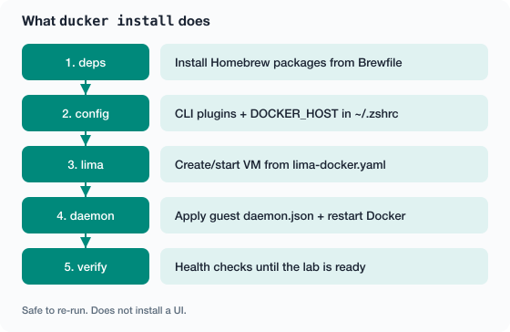

# Architecture

This project is a small, repeatable Docker lab on a Mac: real Debian, rootless Engine, files you can put in git. The guest runs on Apple’s native Virtualization framework (`vz`) via Lima — not a heavyweight third-party hypervisor — so it stays easier on host CPU and RAM when you size the profile sanely. It is not “Docker Desktop with different branding.”

What we care about:

- A Debian 13 guest you can reason about
- Rootless Docker with a real `daemon.json`
- Host `docker` talking to Lima over `DOCKER_HOST`
- Native `vz` + virtiofs (and Rosetta when you need amd64)
- Install / verify / doctor you can re-run without guessing

## Picture


Same tree as text (for copy/paste):

```text
macOS (Apple Silicon)
  └── Homebrew
        ├── limactl
        ├── docker (CLI)  ──DOCKER_HOST──▶  Lima socket
        ├── docker-compose
        └── docker-buildx
  └── Lima VM (vz + virtiofs + Rosetta)
        └── Debian 13 (aarch64)
              └── Docker Engine (rootless)
                    └── containerd + runc → containers
```

We’ve been validating against Lima `2.x` and Docker `29.x`.

## Details that actually bite people

| Topic | What you get |
| --- | --- |
| Guest arch | `aarch64` (same chips as macOS `arm64`) |
| Image platform | `linux/arm64` |
| VM type | `vz` — Apple’s native Virtualization.framework (stay on this for Apple Silicon) |
| Mounts | VirtioFS — don’t put hot dirs like `node_modules` only on a Mac bind mount |
| Docker | Rootless |
| Storage | `overlayfs` via containerd snapshotter (not the old `overlay2` daemon flag) |
| BuildKit | In the daemon; host still needs the `docker-buildx` plugin |

## Lima 2.x gotchas

1. The template must have images (`images:` or `base: template:_images/...`). A YAML with only CPU/RAM/disk dies with `field images must be set`.
2. Keep your template **outside** `~/.lima/<instance>/`. That folder is the running instance, not your source of truth.
3. Start with an explicit name: `limactl start --name=docker /path/to/lima-docker.yaml`.

If you want Debian 13, don’t start from `template://docker` — that path is Ubuntu.

## Sizing

Defaults line up with the `power` profile (think M1 Max / 64 GB class):

| Resource | Default | Why |
| --- | --- | --- |
| CPUs | 8 | Builds without freezing the Mac |
| Memory | 24 GiB | Room for DBs and apps; leave some for macOS |
| Disk | 200 GiB | Images and build cache add up |
| `vmType` | `vz` | Native Apple virtualization — lighter than QEMU-style stacks |
| Rosetta | on | When you need `linux/amd64` |

Smaller machine? `ducker profile small` or `balanced` — see [installation](installation.md#profiles).

## What `ducker install` does



## Files you’ll touch

| Path | Role |
| --- | --- |
| `lima-docker.yaml` | Template you edit |
| `~/.lima/docker/` | Live instance — don’t treat it as the template |
| `~/.docker/config.json` | Host CLI plugins |
| `~/.zshrc` | Managed `DOCKER_HOST` block |
| Guest `~/.config/docker/daemon.json` | Rootless dockerd |

Next: [Docker daemon](docker-daemon.md) · [Performance](performance.md)
