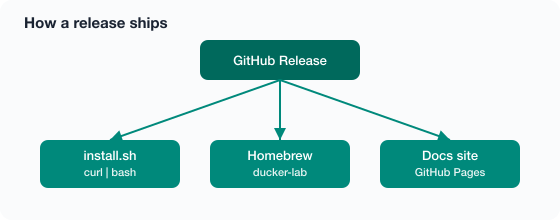

# Releasing

## Version

`config.env` → `DOCKER_LAB_VERSION` (what `ducker about` / `ducker version` show).

## Docs site

Live at [https://nasraldin.github.io/docker-lab/](https://nasraldin.github.io/docker-lab/).

Built from `docs/` + `mkdocs.yml` by [`.github/workflows/docs.yml`](https://github.com/nasraldin/docker-lab/blob/main/.github/workflows/docs.yml).

Local preview and Pages setup: [Docs site](docs-site.md).

## Checklist

1. Bump `DOCKER_LAB_VERSION` in `config.env`
2. Write release notes in the GitHub Release body
3. Make sure CI + Docs are green on `main`
4. Tag and push:

```bash
git tag -a v1.0.0 -m "v1.0.0"
git push origin v1.0.0
```

5. Create the GitHub Release:

```bash
gh release create v1.0.0 --generate-notes
```

6. **Homebrew** — if `HOMEBREW_TAP_TOKEN` is set, `.github/workflows/homebrew.yml` updates `nasraldin/homebrew-tools` (see [Homebrew](homebrew.md)).
7. Smoke-test on a clean Mac:

```bash
brew tap nasraldin/tools && brew install ducker-lab
# or: curl -fsSL …/install.sh | bash
ducker about
ducker verify
```

## How it ships



## What CI checks

On every PR / push to `main`:

- ShellCheck + shfmt (scripts, `ducker`, `install.sh`)
- markdownlint + yamllint + actionlint
- `make test` (static; no live VM)
- Docs: `mkdocs build --strict` on PRs; deploy Pages on `main`

Live VM tests stay manual (or a self-hosted Mac runner): `LIVE=1 make test`.
